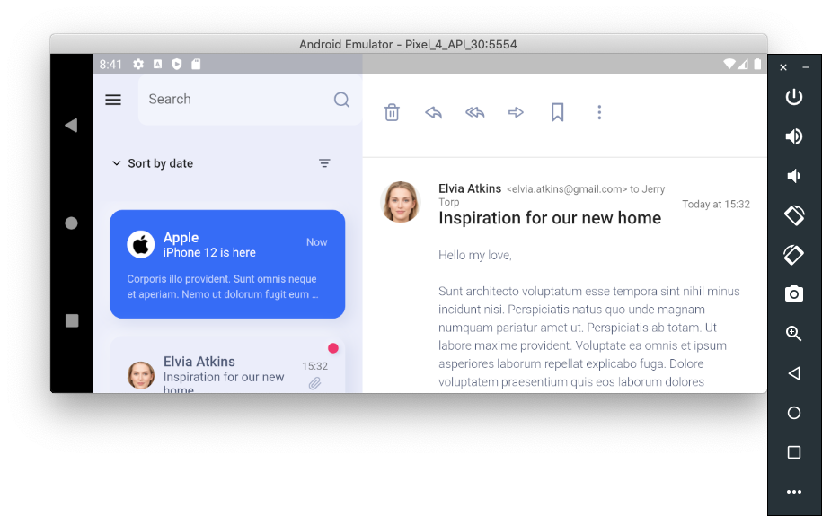
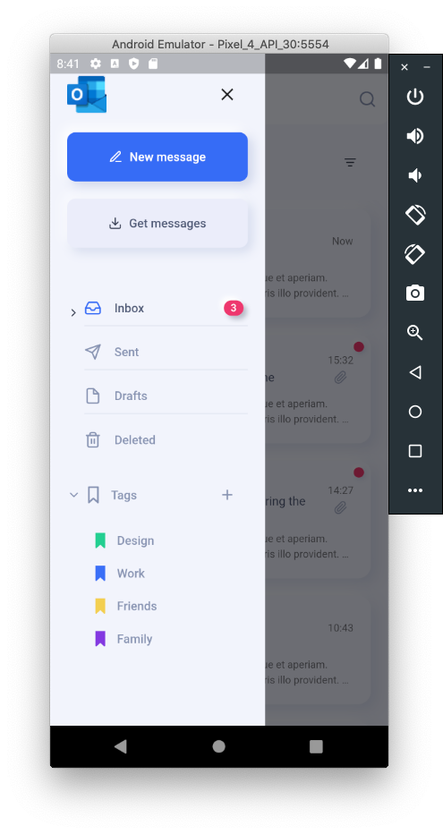
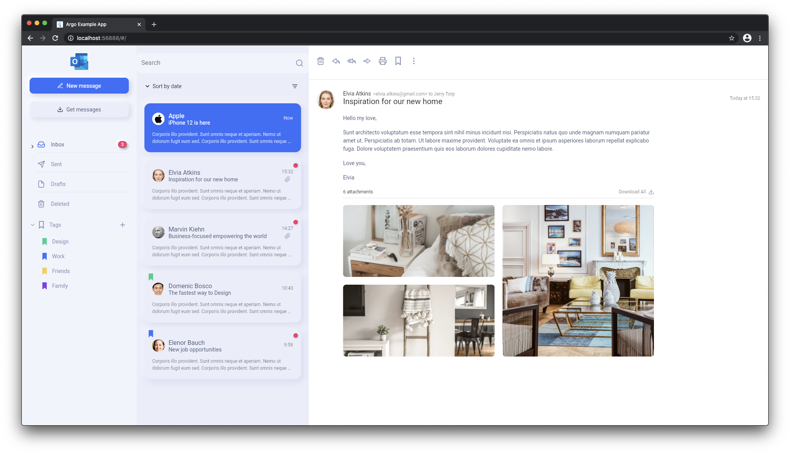
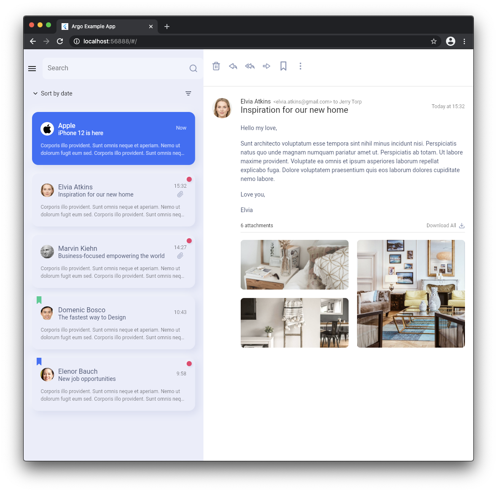
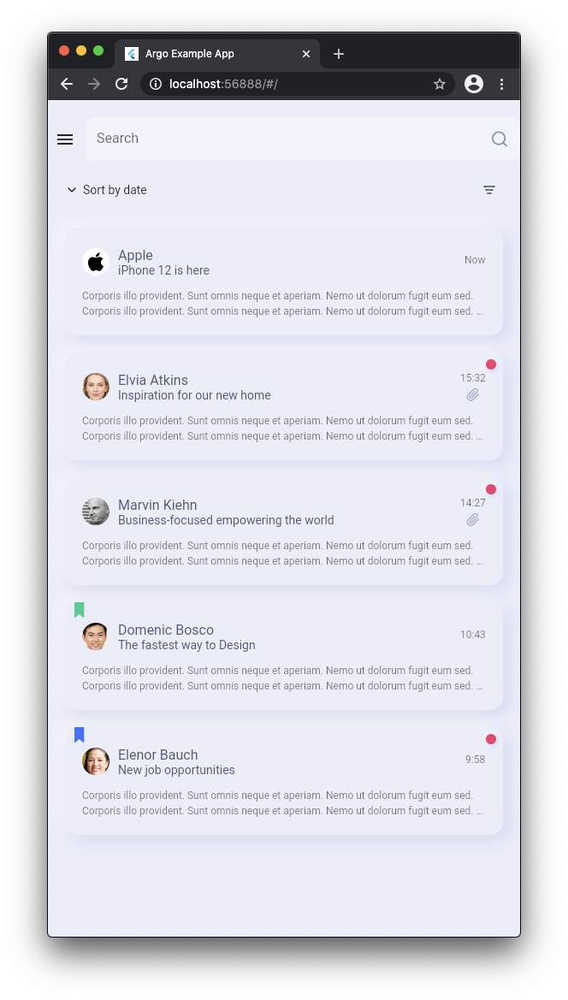
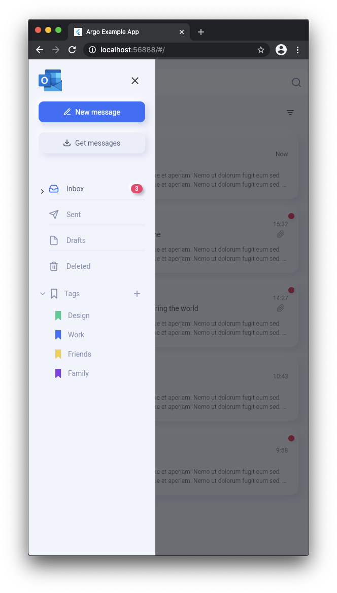
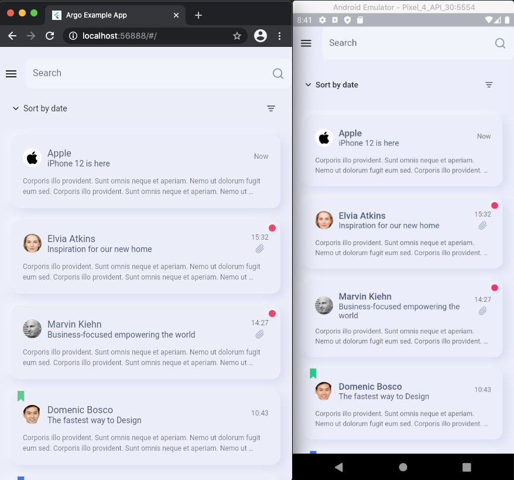

# Argo Example

This project is basic example for argo library use.
- [Based Video from](https://www.youtube.com/watch?v=0mp-Ok00WZE&t=564s) The Flutter Way

  Mobile Landscape
  
  Mobile
  
  Web
  
  Web Tablet responsive
  
  Web Mobile responsive
  
  Web Mobile responsive 2
  
  Web Mobile vs Mobile
  

